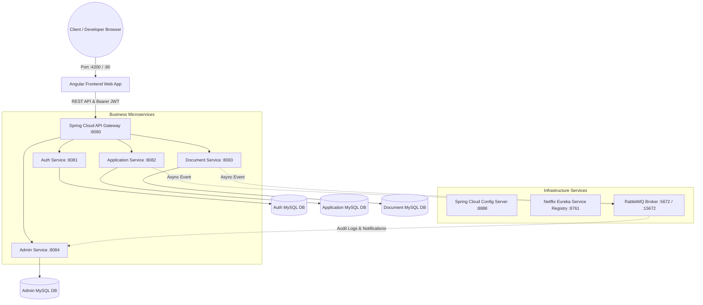

# FinFlow Loan Management System — Master Integration & Testing Guide

## 1. System Overview & HLD Architecture

**FinFlow** is an enterprise-grade, microservices-based loan application, document management, and underwriting platform built with **Angular (Standalone Architecture)** on the frontend and **Spring Boot 3.2** on the backend.



---

## 2. Correct Command Sequence to Clean, Rebuild & Run

To rebuild the Java microservice JAR binaries from source code, clean previous database container states, and spin up the complete infrastructure, execute the following commands in exact order from the project root directory:

```bash
# Step 1: Open Terminal and navigate to the Root Project Directory
cd "c:\Capg-CoreJAVA-Development\Capgemini-Training\All-Capg-Workspaces\FinFlow Loan Management"

# Step 2: Stop & Remove Existing Containers, Networks and Database Volumes
docker-compose down -v

# Step 3: Rebuild All Java Microservice JAR Binaries (Parent POM)
mvn clean package -DskipTests

# Step 4: Build Container Images (including Angular Frontend) and Launch Entire Stack
docker-compose up --build -d

# Step 5: Verify Container Health and Status
docker-compose ps
```

> [!NOTE]
> - Use `mvn clean package -DskipTests` (capital **T** in `skipTests`, and `clean` instead of `clear`).
> - The `-v` flag in `docker-compose down -v` clears previous MySQL database volume states to ensure a fresh, consistent seed state.

---

## 3. Master Ports, Service URLs & Pre-Configured Credentials

| Service / Component | Access URL | Port | Credentials & Description |
| :--- | :--- | :--- | :--- |
| **Angular Web App (Dev)** | `http://localhost:4200` | 4200 | Interactive Web User Interface |
| **Angular Web App (Production)** | `http://localhost` | 80 | Production Nginx Server |
| **Unified Swagger UI Sandbox** | `http://localhost:8090/swagger-ui.html` | 8090 | Test backend API endpoints |
| **Eureka Service Registry** | `http://localhost:8761` | 8761 | Monitor microservices health |
| **RabbitMQ Management Console**| `http://localhost:15672` | 15672 | User: `admin` \| Pass: `admin` |
| **Config Server** | `http://localhost:8888` | 8888 | Centralized Configuration |
| **Demo Applicant Account** | Web UI Login Page | N/A | Email: `rahul.sharma@example.com`<br>Pass: `password123` |
| **Demo Admin Account** | Web UI Login Page | N/A | Email: `admin@finflow.com`<br>Pass: `password123` |

---

## 4. Step-by-Step Web Interface User Testing Guide

Open `http://localhost:4200` (or `http://localhost`) in your browser.

### Test Flow A: Sign In & Registration

#### 1. Demo Applicant Sign In
1. Go to `http://localhost:4200/login`.
2. Click **⚡ Quick Demo Login → "Applicant Demo"**.
   - Auto-fills Email: `rahul.sharma@example.com` | Password: `password123`
3. Click **"Sign In to Dashboard"**.
4. Observe instant redirection to `/applicant/dashboard` with green welcome notification!

#### 2. New User Registration
1. Click **"Sign Out"**, then navigate to `/register`.
2. Enter the field details:
   - **Full Legal Name**: `Amit Verma`
   - **Email Address**: `amit.verma@example.com`
   - **Phone Number**: `9876501234`
   - **Account Type / Role**: Select `Loan Applicant (Standard User)`
   - **Password**: `SecurePass123` *(Observe live green password strength indicator)*
   - **Confirm Password**: `SecurePass123`
   - **Terms & Conditions**: Check the box.
3. Click **"Complete Registration"** → Green toast notification appears → Redirects to `/login`.

---

### Test Flow B: 6-Step Digital Loan Application Wizard

Navigate to `/applicant/apply-loan` or click **"Apply for New Loan"**.

#### Step 1: Personal Information
- **Full Name**: `Amit Verma`
- **Date of Birth**: `1990-08-20`
- **Email**: `amit.verma@example.com` | **Phone**: `9876501234`
- **Address**: `Flat 501, Blue Ridge Towers`
- **City**: `Pune` | **State**: `Maharashtra` | **Pincode**: `411057`
- Click **"Next Step →"**.

#### Step 2: Employment Details
- **Employment Type**: Select `Salaried (Private / Govt)`
- **Employer Name**: `TCS Digital Ltd`
- **Job Title**: `Lead Software Architect`
- **Work Experience**: `8` Years
- Click **"Next Step →"**.

#### Step 3: Financial Details & DTI Assessment
- **Gross Monthly Income**: `₹1,50,000`
- **Existing Monthly EMIs**: `₹20,000`
- **Credit Score**: `810`
- *Observation*: The **Debt-to-Income (DTI) ratio indicator bar** auto-calculates to `13.3%` with a green **"Excellent DTI! High approval probability"** badge.
- Click **"Next Step →"**.

#### Step 4: Loan Specifications & EMI Preview
- **Loan Category / Type**: Select `HOME` (Home Loan @ 8.0% p.a.)
- **Requested Amount**: `₹50,00,000`
- **Tenure (Months)**: Select `240 Months (20 Years)`
- **Loan Purpose**: `Apartment Purchase in Baner`
- *Observation*: The **Interactive EMI & Interest Calculator** dynamically updates:
  - **Estimated Monthly EMI**: `₹41,822`
  - **Total Interest Payable**: `₹50,37,281`
  - **Proportion Bar**: `49.8% Principal / 50.2% Interest`
- Click **"Next Step →"**.

#### Step 5: Required Document Uploads
- Drag & Drop or Browse files:
  - Select document type: `Aadhaar Card`
  - Select document type: `Salary Slip / Income Proof`
- Click **"Next Step →"**.

#### Step 6: Review & Final Submission
- Review summary details across Personal, Employment, and Loan specifications.
- Check the confirmation box: *"I declare that the information provided is accurate..."*
- Click **"Submit Loan Application"**.
- *Observation*: Green notification toast fires, application status changes to `SUBMITTED`, and UI navigates to `/applicant/applications/:id`.

---

### Test Flow C: Application Tracking & Status Timeline

1. Navigate to `/applicant/applications`.
2. Click **"Details"** on your created application.
3. Observe:
   - **Visual Progress Bar Timeline**: `Submitted` stage is highlighted in green/blue.
   - **Details Cards**: Displays loan amount (`₹50,00,000`), interest rate (`8.0%`), and uploaded document attachments.

---

### Test Flow D: Admin Underwriting & Decision Desk

#### 1. Admin Sign In
1. Click **"Sign Out"** in top header.
2. Login as Admin:
   - **Email**: `admin@finflow.com` | **Password**: `password123`
3. Redirection lands on `/admin/dashboard`.

#### 2. Underwriting Command Center
1. Observe portfolio KPI cards: Total Applications, Action Needed, Approved Loans, and Total Capital Exposure (`₹1.05 Cr`).
2. Observe category breakdown bar charts (`PERSONAL`, `HOME`, `EDUCATION`, `BUSINESS`, `VEHICLE`).

#### 3. Execute Decision
1. Navigate to `/admin/applications`.
2. Click **"Review File"** on Application `#101` or `#102`.
3. In the **Underwriter Decision Desk** panel:
   - Enter Remarks: `Credit verified via CIBIL. Income meets 40% DTI threshold. Approved.`
   - Click **"Approve Loan"**.
4. Observe:
   - Status updates instantly to `APPROVED`.
   - Application timeline stage updates to `Approved / Decision`.
   - Asynchronous audit event report is published to RabbitMQ!

#### 4. Audit Stream & Reports
1. Navigate to `/admin/documents`: Review uploaded files, click **"Verify"** or **"Reject"**.
2. Navigate to `/admin/reports`: Inspect live **RabbitMQ Audit Stream Logs** (`APPLICATION_SUBMITTED`, `DOCUMENT_UPLOADED`, `UNDERWRITER_DECISION`).

---

## 5. Testing Endpoints via Unified Swagger UI

Open `http://localhost:8090/swagger-ui.html` in your browser.

1. **Select Definition Dropdown**: Choose between `Auth Service`, `Application Service`, `Document Service`, or `Admin Service`.
2. **Authenticate & Get Token**:
   - Switch to **Auth Service**.
   - Call `POST /gateway/auth/login` with payload `{"email":"john@example.com","password":"password123"}`.
   - Copy the raw JWT token string.
3. **Authorize Swagger**:
   - Click the **Authorize 🔓** lock button at top right.
   - Paste token in `Value` field and click **Authorize**.
4. **Test Business Endpoints**:
   - **Calculate Rate**: `GET /gateway/applications/calculate-rate?amount=500000&purpose=Home Purchase` (Returns `8.0`).
   - **Underwriter Decision**: `POST /gateway/admin/applications/101/decision` with payload `{"decisionType":"APPROVED","remarks":"Approved via Swagger"}`.
   - **Fetch Audit Logs**: `GET /gateway/admin/reports`.
