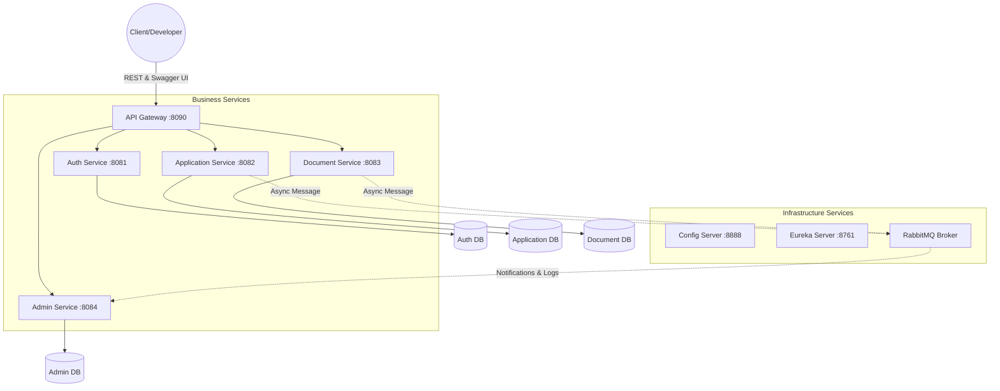
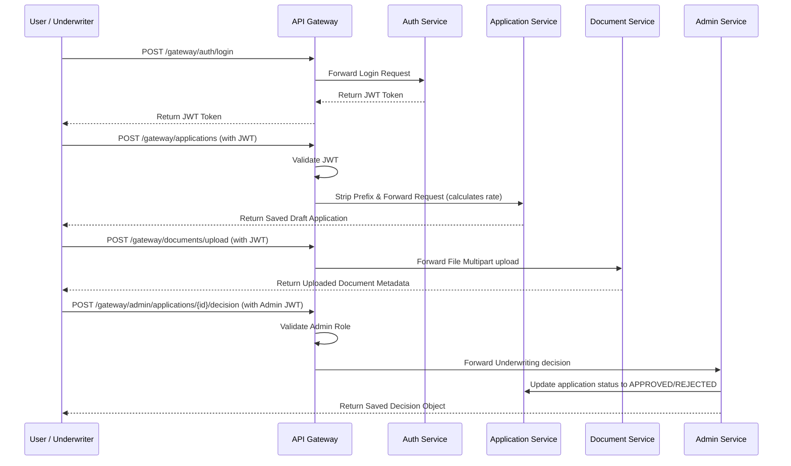

# FinFlow Loan Management System - Project Documentation

## 1. Project Overview
**FinFlow** is a modern, microservices-based backend loan management platform designed to streamline the loan application, documentation, and approval process. It features a robust Spring Boot backend architecture, ensuring scalability, security, and high performance, with interactive testing fully supported via Swagger OpenAPI docs aggregation at the Gateway.

---

## 2. High-Level Architecture (HLD)

The system follows a distributed microservices architecture where each service has a specific responsibility and its own database.

---

## 3. Low-Level Design (LLD)

### 3.1. Service Breakdown

| Service | Technology | Port | Responsibility |
| :--- | :--- | :--- | :--- |
| **Config Server** | Spring Cloud Config | 8888 | Centralized external configuration management. |
| **Eureka Server** | Spring Cloud Netflix | 8761 | Service registration and discovery. |
| **API Gateway** | Spring Cloud Gateway | 8090 | Entry point, JWT validation, and Swagger OpenAPI aggregation. |
| **Auth Service** | Spring Security, JWT | 8081 | User registration, authentication, and role management. |
| **Application Service** | Spring Boot, JPA | 8082 | Manages loan applications and dynamic interest rate calculations. |
| **Document Service** | Spring Boot, JPA | 8083 | Handles file uploads and document metadata. |
| **Admin Service** | Spring Boot, JPA | 8084 | Underwriting decisions, approvals, and system reporting. |

### 3.2. Data Flow (Sequence Diagram)
The following diagram illustrates a typical loan submission and underwriting review flow:

### 3.3. Security Implementation
*   **Authentication:** JWT-based stateless authentication.
*   **Gateway Filter:** `AuthenticationFilter` intercepts requests, validates the token using `JwtUtil`, and injects the `X-User-Id` and `X-User-Email` headers.
*   **RBAC:** Role-Based Access Control implemented in the Gateway for `/gateway/admin/**` paths, restricting access exclusively to users with the `ADMIN` role claim.
*   **Swagger Bypass:** Swagger and OpenAPI docs routes (`/v3/api-docs` and `/swagger-ui`) bypass security verification at the gateway level to allow public interactive sandbox testing.

---

## 4. Core Features

1.  **Risk-based Interest Calculator:** Automatically calculates loan interest rates based on the loan purpose (Education: 6.5%, Home: 8.0%, Personal: 10.5%, Business: 12.0%) and adjusts for loan amount risk adjustments (premiums on low amounts, discounts on high amounts).
2.  **Digital Document Uploads:** Saves attachments (ID cards, pay slips) on the filesystem, linked via logical database records.
3.  **Auditable Logging:** RabbitMQ topic queue logs application and document events asynchronously to feed the Admin Service audit trails.

---

## 5. Technology Stack
*   **Backend:** Java 17, Spring Boot 3.2.4, Spring Cloud (Gateway, Config, Eureka).
*   **Database:** MySQL 8.0.
*   **Messaging:** RabbitMQ.
*   **Observability:** Spring Boot Actuator.
*   **Documentation:** SpringDoc OpenAPI (Swagger).

---

## 6. Port Configuration Summary
*   **Config Server:** 8888
*   **Eureka Server:** 8761
*   **API Gateway:** 8090 (Public Entry / Swagger portal)
*   **Auth Service:** 8081
*   **Application Service:** 8082
*   **Document Service:** 8083
*   **Admin Service:** 8084
*   **RabbitMQ UI:** 15672
